# 🚀 Documentación Oficial del Proyecto: Plataforma de Cursos Online

Este proyecto tiene como objetivo desarrollar una Plataforma de Cursos Online, construida sobre un entorno Docker, con backend en PHP y base de datos PostgreSQL.

## 📂 Estructura del Proyecto

    proyectoDB/
    ├── backend/
    ├── documentacion/
    │   ├── imagenes/
    │   │   ├── crear_repositorio.png
    │   │   ├── docker_compose.png
    │   │   └── ...
    │   ├── pasos.md
    │   └── base_de_datos.md
    ├── docker-compose.yml
    └── README.md              

## ✅ Instrucciones Paso a Paso

### 1. Crear un Nuevo Repositorio en GitHub
- Ve a tu cuenta de GitHub y crea un nuevo repositorio. Nombre del Proyecto: ProyectoDB.
- Añade un archivo README.md inicial describiendo el propósito del proyecto.

### 2. Clonar el Repositorio en tu Máquina Local

    git clone <URL-del-repositorio>
    cd ProyectoDB

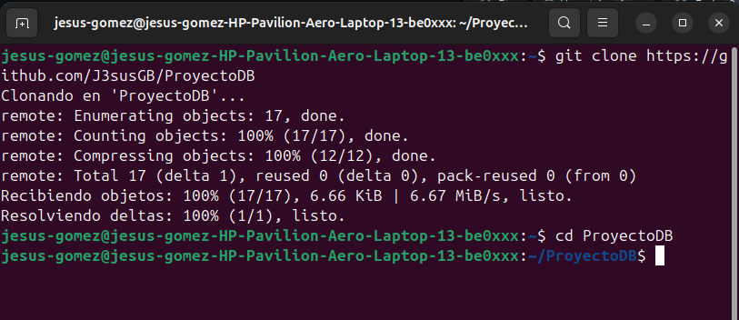

### 3. Crear un Proyecto Sencillo de Base de Datos con Docker

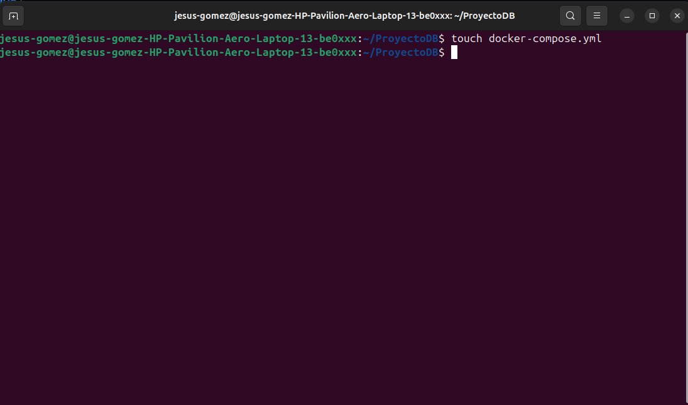

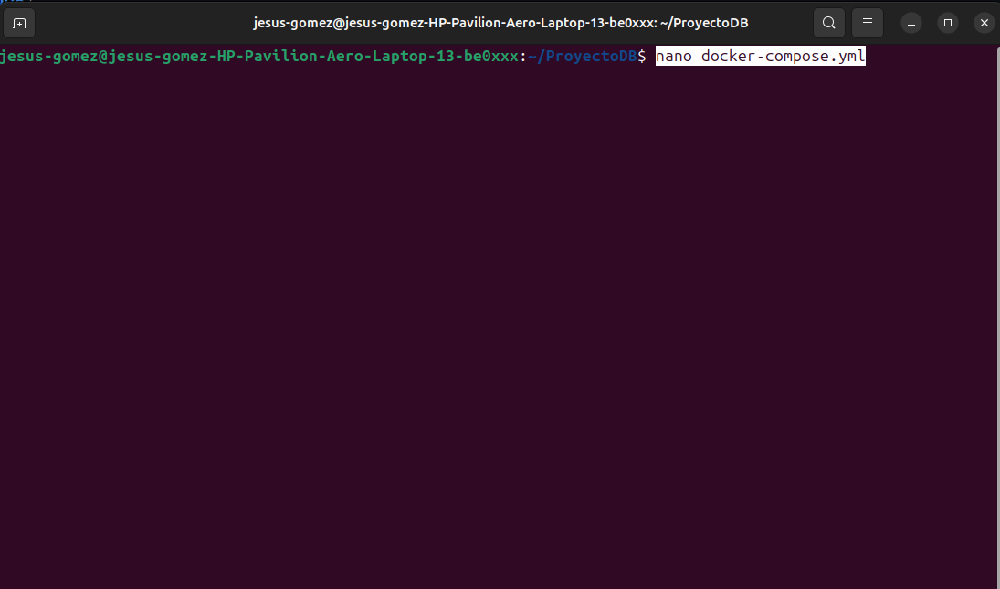

imagen de doker composer 2 (pendiente subir)

### 4. Levantar el Contenedor PostgreSQL con Docker

    docker-compose up -d

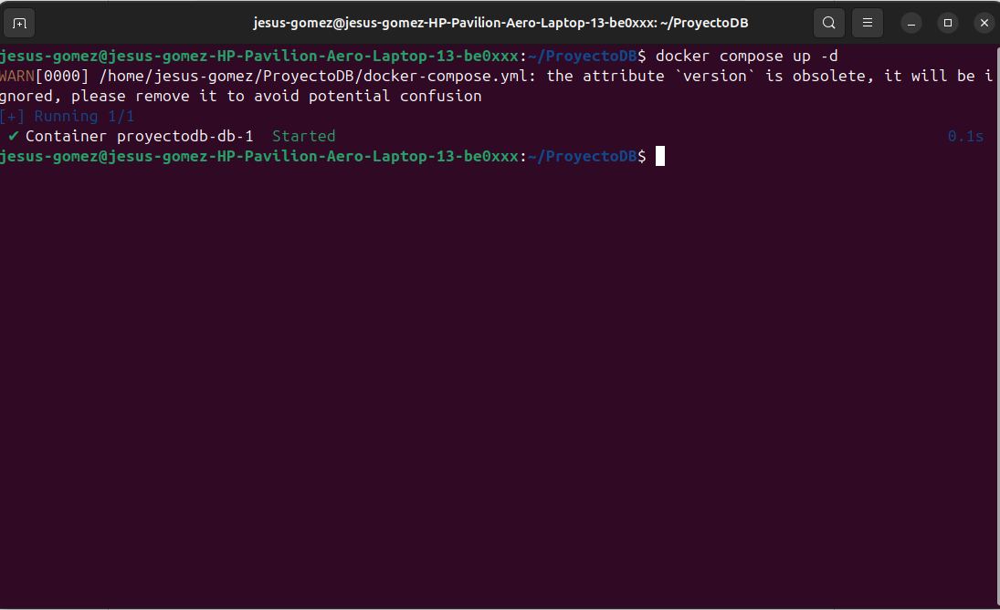

### 5. Crear Ramas y Hacer Commits

    git checkout -b feature/database-setup

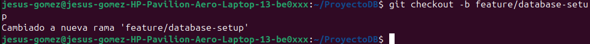

#### - Realiza cambios y guarda commits:

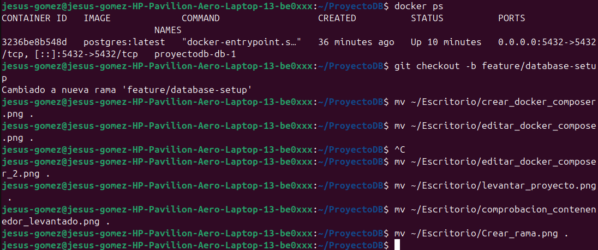

#### - Sube tu rama a GitHub:

      git push -u origin feature/database-setup

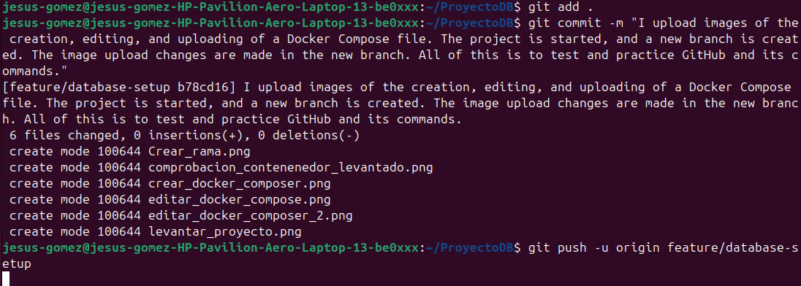

### 7. Conectar PostgreSQL con DBeaver

#### Instalar PostgreSQL
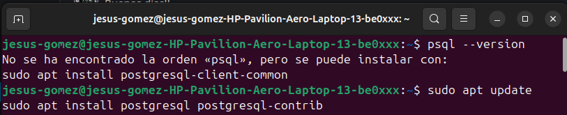

#### Comprobar estado de PostgreSQL
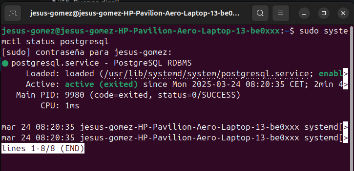

#### Comprobar puerto de uso de PostgreSQL
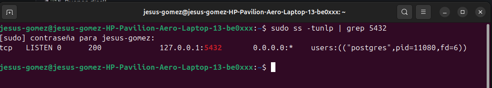

#### Crea usuario en PostgreSQL
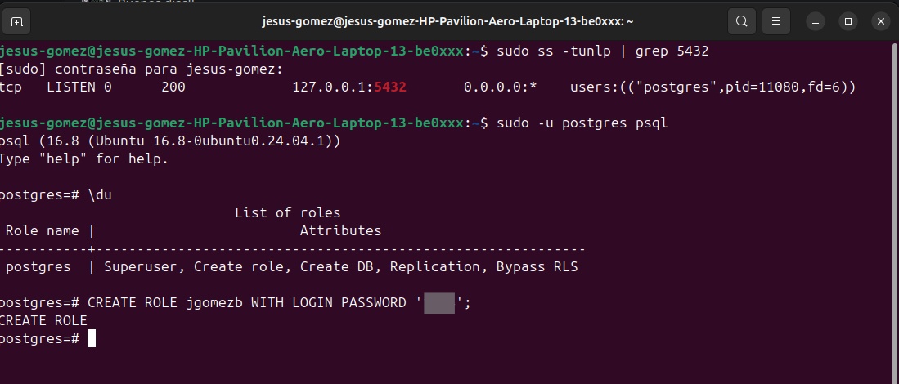

#### Dar al usuario permisos de súper usuario
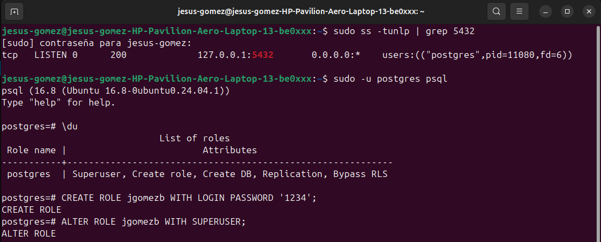

#### Probar conexión en DBeaver
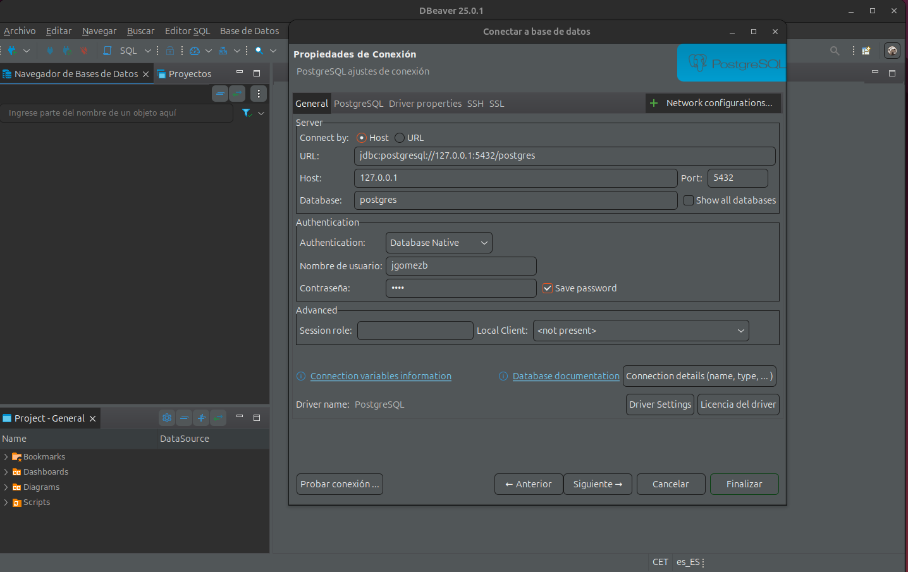

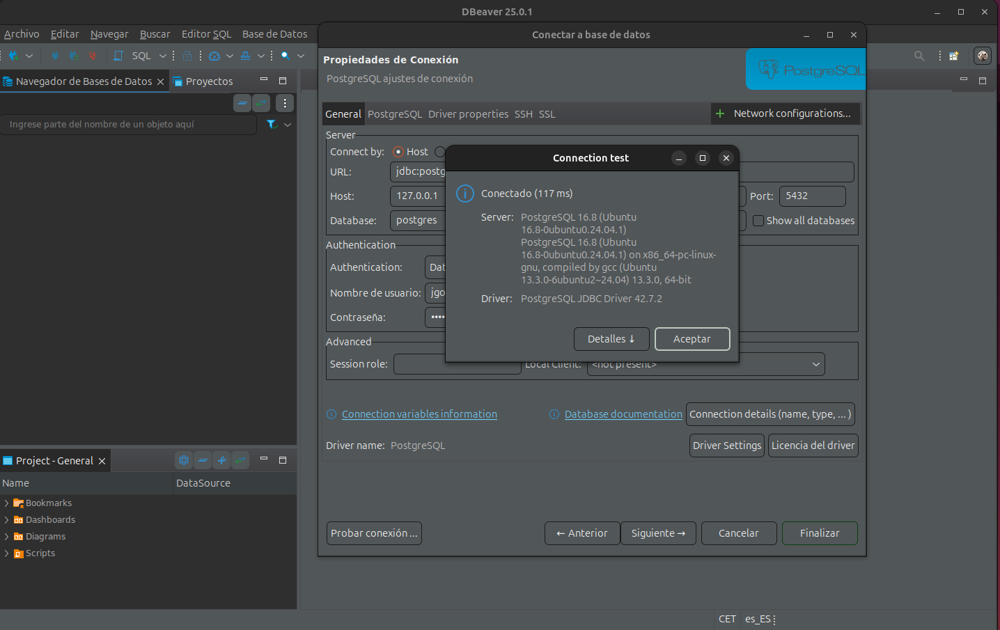

### 8. Diseñar base de datos del proyecto y un Diagrama Entidad-Relación (ERD)

#### - Proyecto elegido: Plataforma de Cursos Online.
#### - Entidades: usuarios, cursos, lecciones, evaluaciones, inscripciones, certificados.

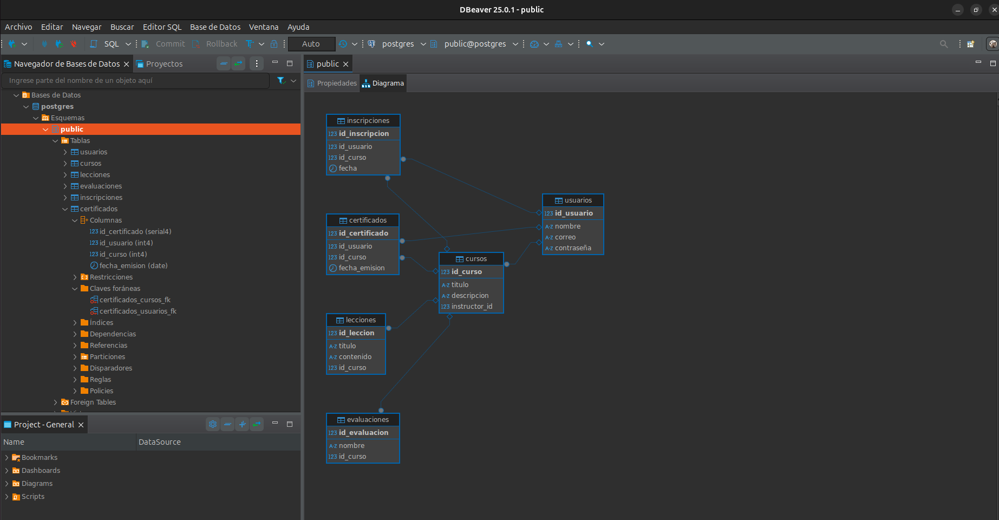

➡️ Ver la documentación completa de la Base de Datos aquí:
👉 ./base_de_datos.md

9. Subir Cambios a GitHub
- Fusiona la rama feature/database-setup con main:

    git checkout main
    git merge feature/database-setup
    git push

- Imagen: ./imagenes/fusionar_ramas.png
